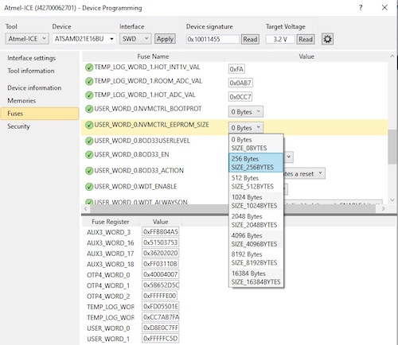

# SAMD21 settings driver

Driver for storing settings on SAMD21 chips.

There are three options:

1. **RWW Flash** \
Some SAMD21 chips have a seperate RWW flash area, of 2kB-8kB size. This area is seperate from the main flash array. \
Note: this method is implemented and tested.

2. **Standard Flash** \
You can write to any part of the flash memory as long as the region is not locked. The disadvantage compared to the RWW Flash is twofold: firstly, writing to this memory cannot be done in parallel to reading from the flash. Secondly, the normal flash memory will be overwritten when flashing new program code, unless you modify your board description files to reserve the memory.

3. **EEPROM emulation** \
All SAMD21s support EEPROM emulation, where an area of the main flash is reserved for the application storage. \
Note: It's not clear how this method is different to just writing to the flash. It may have to do with the memory locking settings.

## Using RWW flash

To use the RWW flash to store settings, you have to make sure the flash region is not locked (you can set the lock fuses using MCP Studio or other SAM development tools).

Otherwise there is nothing special to do. When reprogramming the chip, be careful not to erase the RWW area.

You can use multiple settings objects to store to different areas of the RWW. 
To do so, specify an offset to the constructor:

```c++
SAMDNVMSettingsStorage settings0 = SAMDNVMSettingsStorage();
SAMDNVMSettingsStorage settings1 = SAMDNVMSettingsStorage(NVMCTRL_ROW_SIZE);
SAMDNVMSettingsStorage settings2 = SAMDNVMSettingsStorage(NVMCTRL_ROW_SIZE*2);
```

Note: the offset must be a multiple of the flash memory row size, typically 256 bytes.


## Using normal flash

Add a build-flag to your build to set the base address where you want to store to, e.g.:

`-DSIMPLEFOC_SAMDNVMSETTINGS_BASE=0x3FF00`

The base address has to be a multiple of the ROWSIZE, which is 256 bytes. Normally, you would use memory at the end of the flash, so (NVMCTRL_FLASH_SIZE - n * ROWSIZE) would be a good setting to use, e.g.:

`-DSIMPLEFOC_SAMDNVMSETTINGS_BASE=(NVMCTRL_FLASH_SIZE - ROWSIZE)`

or

`-DSIMPLEFOC_SAMDNVMSETTINGS_BASE=(NVMCTRL_FLASH_SIZE - 2*ROWSIZE)`

Then use the settings as normal.

You'll have to adjust your board files to exclude the chosen flash area in the ldscript to prevent it being erased when you re-program, if you care to keep your settings when reflashing.

## Using EEPROM emulation

To use the EEPROM emulation, use a tool like MCP Studio to set the chip fuses to reserve an area of flash for EEPROM emulation:



Normally 256 bytes (one flash row) should be plenty for SimpleFOC settings... Obviously, the area you reserve for EEPROM can't be used for your main program. 

Add a build-flag to your build to set the base address of your EEPROM memory:

`-DSIMPLEFOC_SAMDNVMSETTINGS_BASE=0x3FF00`

like for the "Using normal flash" described above.