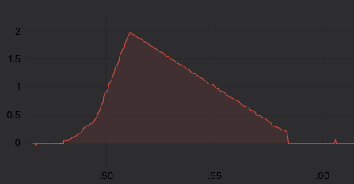
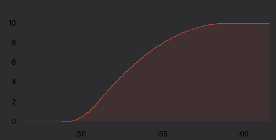
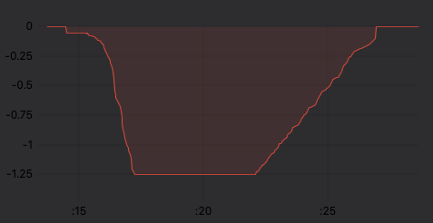
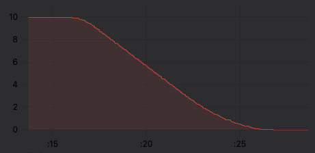

# Trapezoids

Classes for trapezoidal motion profiles. Intended as a starting point for your own higher level control schemes.

## TrapezoidalPlanner

Produces trapzoidal velocity profiles for the motor, used with `MotionControlMode::velocity`.

The following graphs show a commanded angle change from 0 to 10 radians executed by the trapezoidal planner. The accelleration limit is set
to 1rad/s/s while the decelleration limit is set to 0.25rad/s/s. The maximum velocity is set to 5rad/s, which is not reached, resulting in a triangular shaped
velocity profile. The position profile is nice smooth shape, as expected.

|Velocity|Position|
|---|---|
|  |  |


In the following example the angle is commanded back from 10 to 0 radians, but this time the velocity limit on the planner is set to 1.25rad/s. You can see the trapezoidal shape of the velocity profile (negative because we're going backwards).

|Velocity|Position|
|---|---|
|  |  |


### Usage

The following *incomplete* code example shows only the parts relevant to integrating the planner:

```c++

Commander commander = Commander(Serial);
BLDCMotor motor = BLDCMotor(7); // 7 pole pairs
TrapezoidalPlanner trapezoidal = TrapezoidalPlanner(5.0f, 1.0f, 0.25f, 0.2f);

float target_angle = 0.0f;

void onTarget(char* cmd){ commander.scalar(&target_angle); trapezoidal.setTarget(target_angle); }

void setup() {

    ...
  motor.controller = MotionControlType::velocity;
  trapezoidal.linkMotor(motor);
  motor.init();
    ...
  commander.add('T', onTarget, "target angle");
  trapezoidal.setTarget(target_angle);
}


int32_t downsample = 50;    // depending on your MCU's speed, you might want a value between 5 and 50...
int32_t downsample_cnt = 0;

void loop() {

  if (downsample > 0 && --downsample_cnt <= 0) {
    motor.target = trapezoidal.run();
    downsample_cnt = downsample;
  }
  motor.move();
  motor.loopFOC();
  commander.run();

}

```